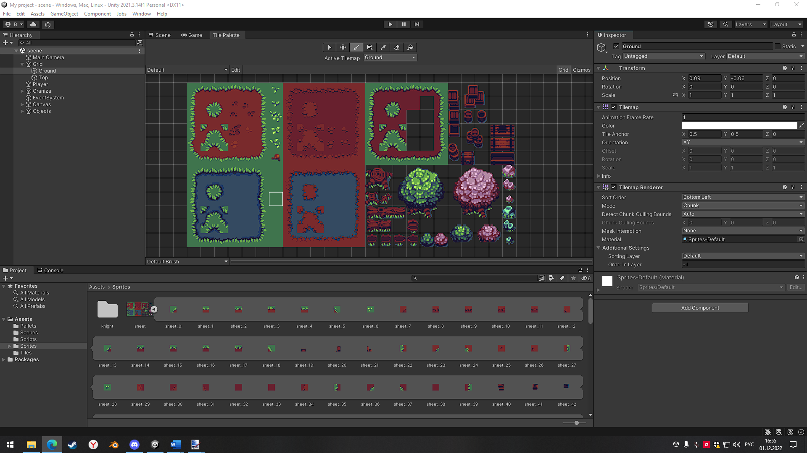
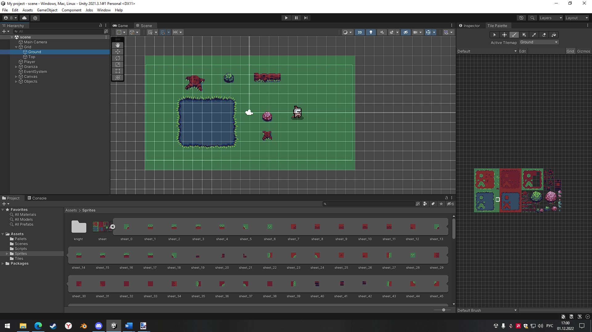
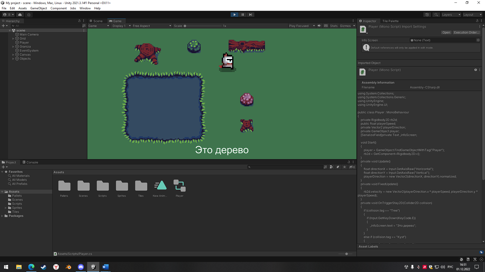
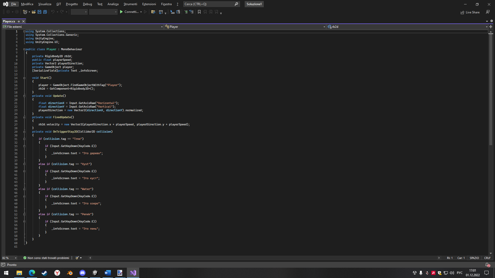

Выполнил: Вельмогин А.Д.
Группа: ЭВТ-70
Игровой движок: Unity 2021.3.14f1
Название работы: Изучение Tilemap

  

Рисунок 15.1 - Перекидываем и разделяем спрайт на множесто компонентов 

  

Рисунок 15.2 - Создаем сцену из ранее созданных объектов, добовляем препятствия и гровой объект 

  

Рисунок 15.3 - Сцена игры

  

Рисунок 15.4 - Скрипт игрового объекта Player.cs

