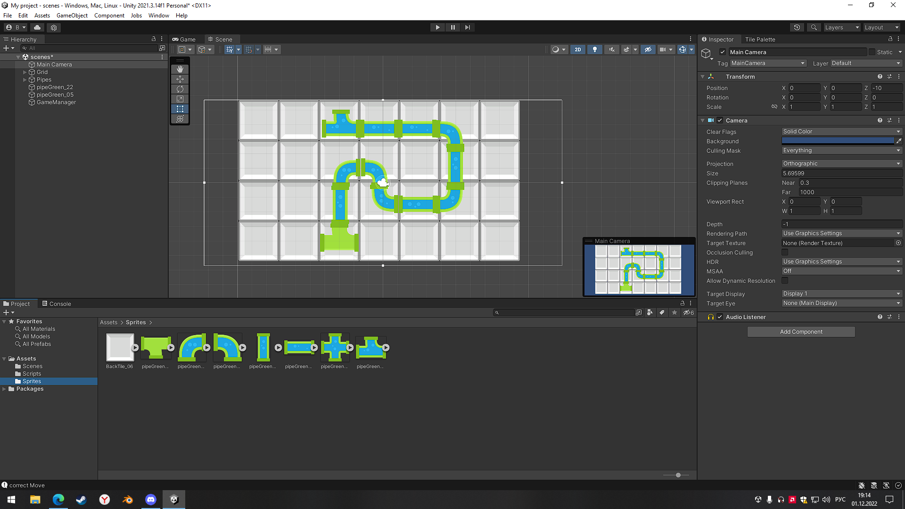
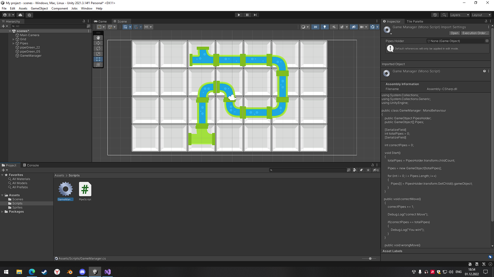
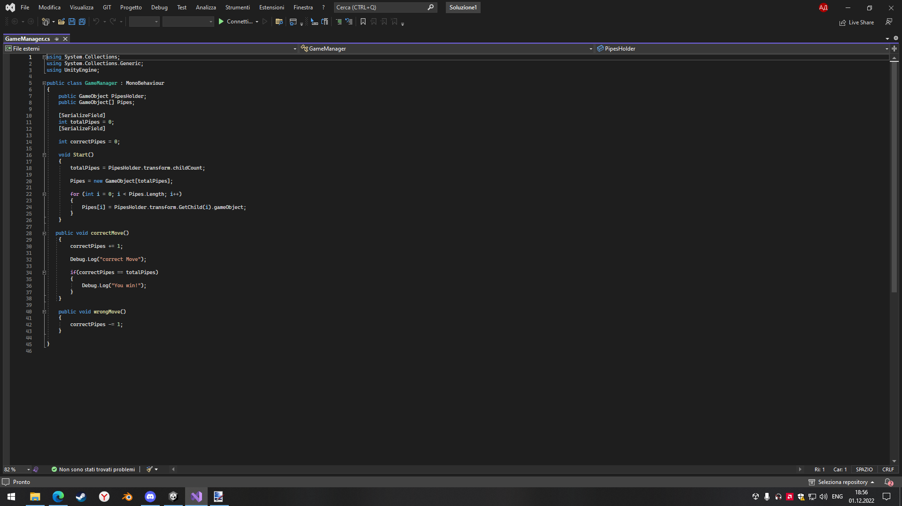
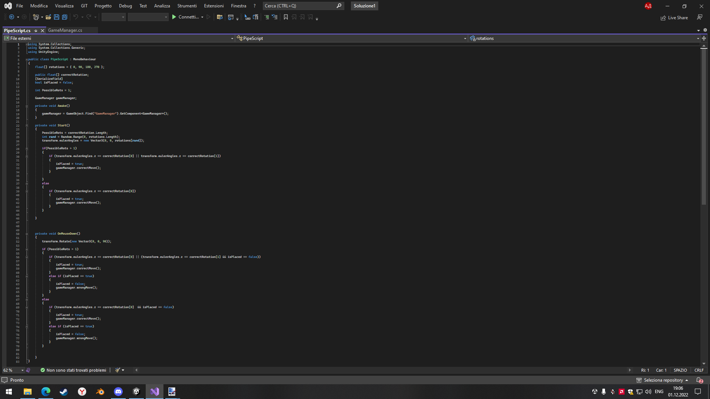
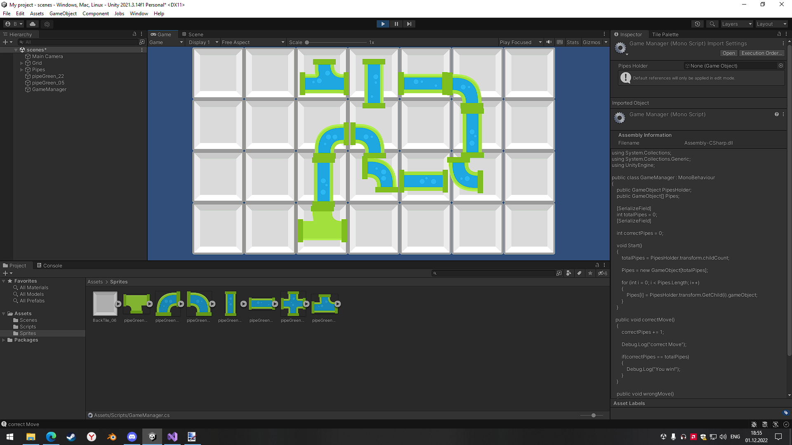

Выполнил: Вельмогин А.Д.
  

 Группа: ЭВТ-70
  

 Игровой движок: Unity 2021.3.14f1
  

 Название работы: Puzzle Plumber
  

  

Рисунок 17.1 - Перекидываем данные спрайты в папку Sprites

  

Рисунок 17.2 - Создаем из спрайтов задний фон и будущие игровые объекты

  

Рисунок 17.3 - Создаем скрипт GameManager.cs

  

Рисунок 17.4 - Создаем скрипт PipeScript.cs

  

Рисунок 17.5 - Готовая сцена игры

