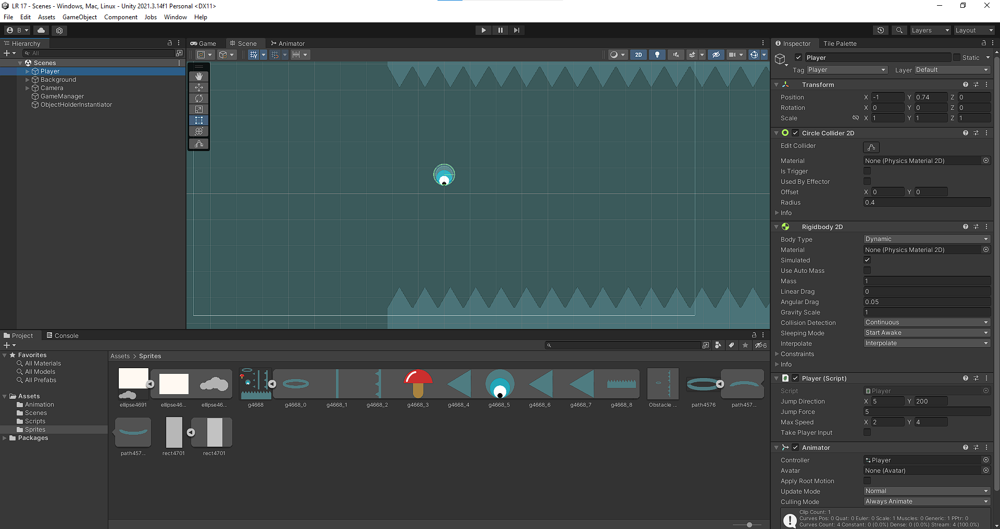
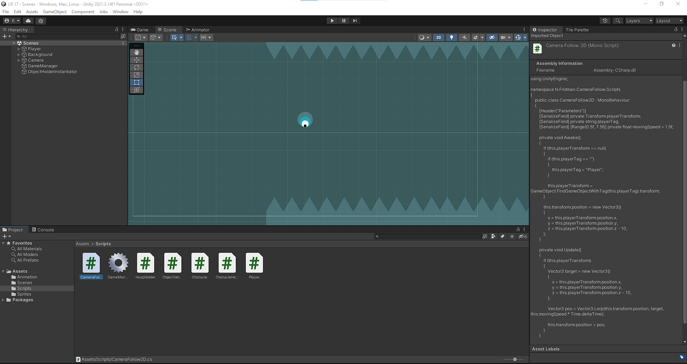
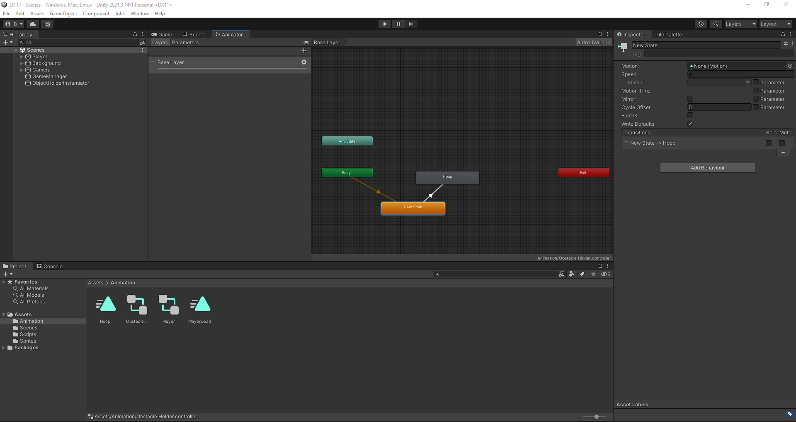
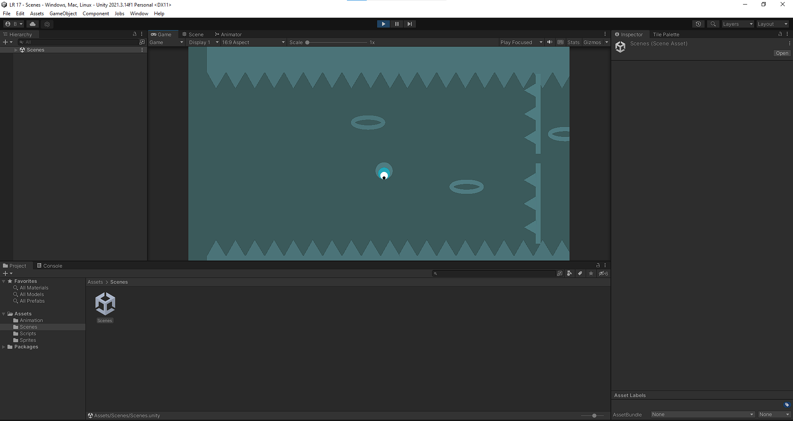

  Выполнил: Вельмогин А.Д.
  

 Группа: ЭВТ-70
  

 Игровой движок: Unity 2021.3.14f1
  

 Название работы: Разработка проекта hophophop
  

  

Рисунок 23.1 - Перекидываем спрайты и создаем из них сцену

  

Рисунок 23.2 - Создаем множество кодов для объектов и настраиваем их

  

Рисунок 23.3 - Создаем анимации для определенных объектов

  

Рисунок 23.4 - Готовая сцена игрового проекта 

