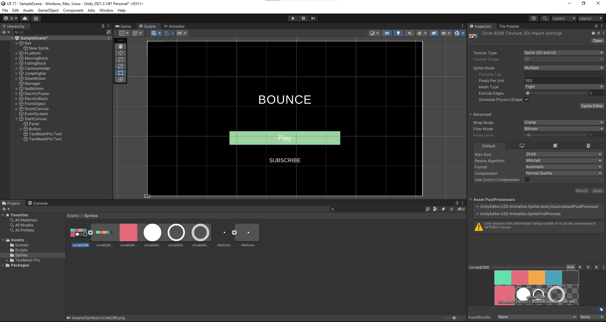
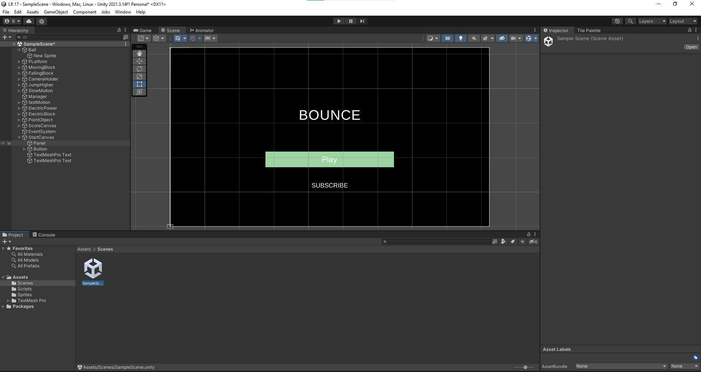
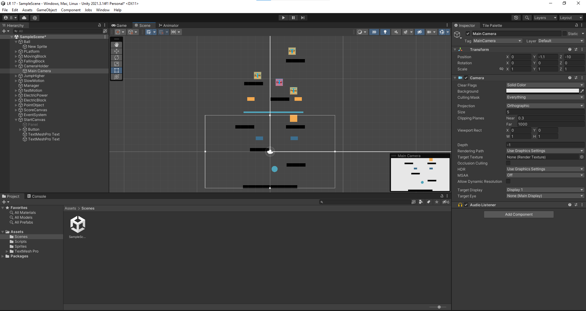
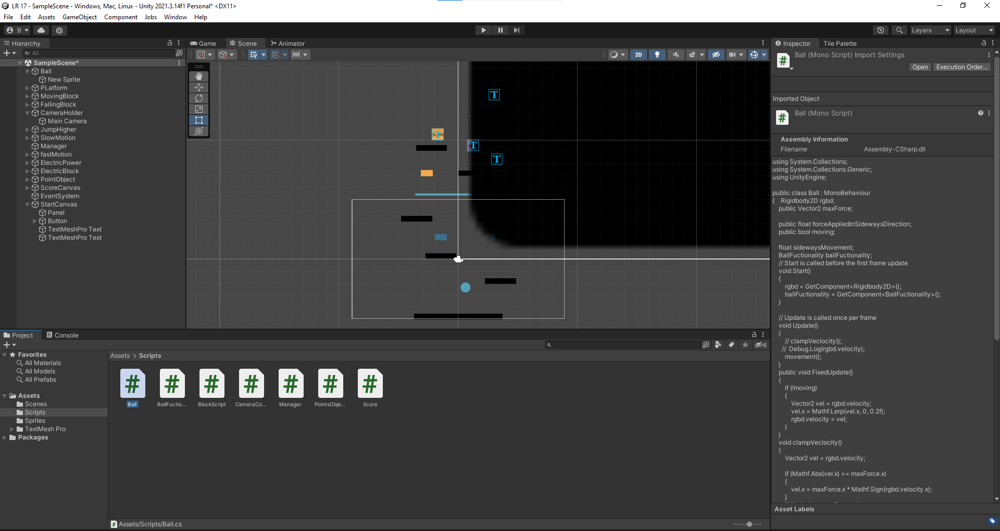
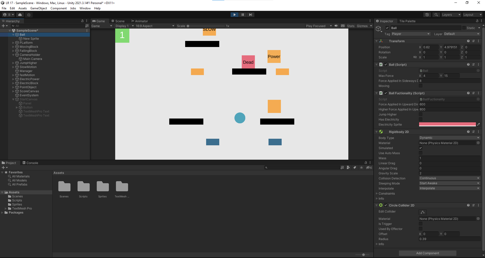

  Выполнил: Вельмогин А.Д.
  

 Группа: ЭВТ-70
  

 Игровой движок: Unity 2021.3.14f1
  

 Название работы: разработка игрового проекта Bounce
  

  

Рисунок 25.1 - Перекидываем спрайты и разделяем их 

  

Рисунок 25.2 - Создаем из спрайтов сцену меню 

  

Рисунок 25.3 - Создаем сцену с уровнем

  

Рисунок 25.4 - Создаем множество кодов для объектов

  

Рисунок 25.5 - Готовая сцена уровня

